# 🚀 Red Hat OpenShift Lab

## ✅ Overview

This project successfully demonstrates working with **Red Hat OpenShift** using both the **oc CLI** and the **web console**. The lab included deploying an application from a Git repository, inspecting build configurations and image streams, and enabling **autoscaling**.

---

## 📂 Repository Structure

```
openshift-lab/
├── README.md      # this file
└── images/        # place your screenshots here
```

---

## 📝 Completed Steps

### 1. Environment Verification

* Opened a terminal session and confirmed the **oc CLI** was installed:

  ```bash
  oc version
  ```
* Navigated to the project workspace `/home/project`.
* Cloned the required repo:

  ```bash
  git clone https://github.com/ibm-developer-skills-network/CC201.git
  ```

📷 *Screenshot: verifying CLI & cloning repo*
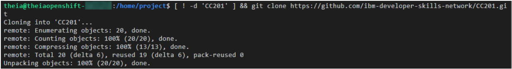

---

### 2. Using the oc CLI

* Listed pods running in the namespace:

  ```bash
  oc get pods
  ```
* Checked BuildConfigs and project details with:

  ```bash
  oc get buildconfigs
  oc project
  ```

📷 *Screenshot: oc commands executed*
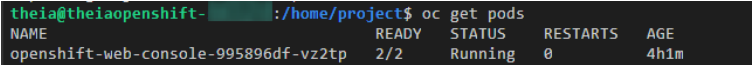
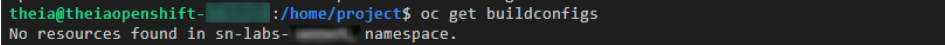
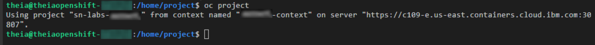

---

### 3. OpenShift Web Console

* Launched the **OpenShift web console** via Skills Network Toolbox.
* Explored both *Administrator* and *Developer* perspectives.
* Reviewed **Dashboard**, **Overview**, resources inventory, and YAML definitions.
  📷 *Screenshot: web console overview*
  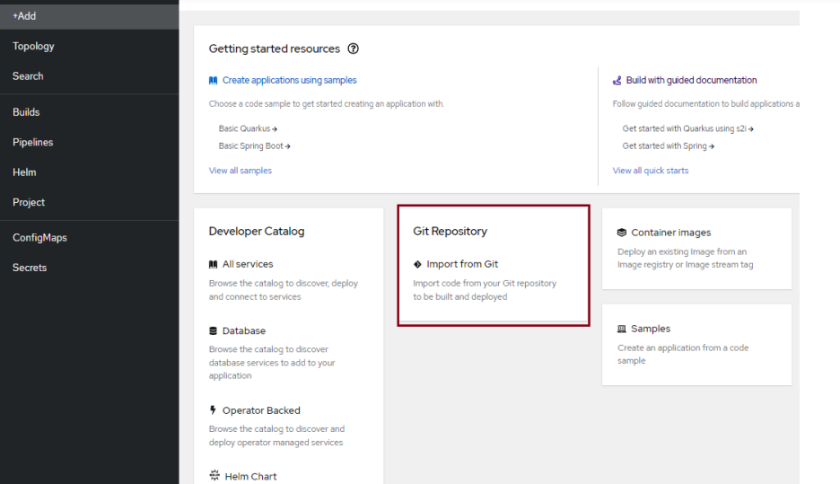

---

### 4. Deploying Application from Git

* Switched to **Developer** perspective → Topology view.
* Added a new application from Git:

  * Repo: `https://github.com/sclorg/nodejs-ex.git`
  * Selected **Node.js** builder image.
* Confirmed application appeared in Topology after build.
  📷 *Screenshot: deploy app from Git*
  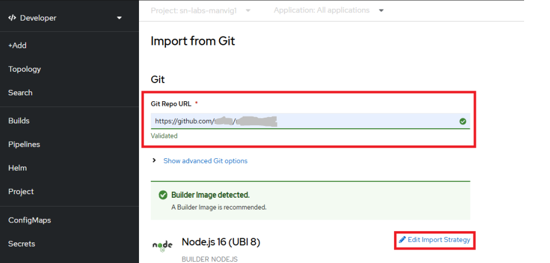
  
  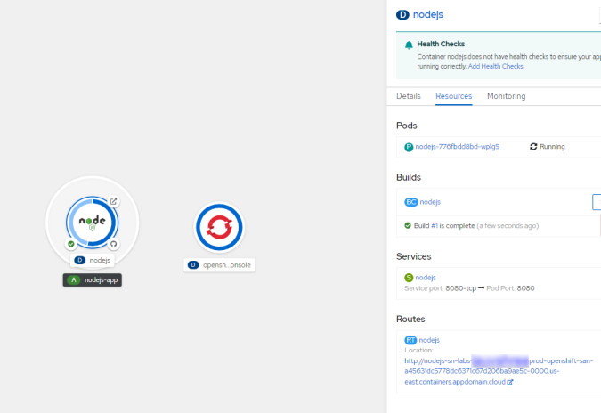
---

### 5. Inspect Build & ImageStream

* Viewed build logs (repository cloned, Dockerfile generated, image built & pushed).
* Explored Build Config (triggers, webhooks, strategies).
* Checked ImageStreamTag and image history.
  📷 *Screenshot: build logs and configs*
  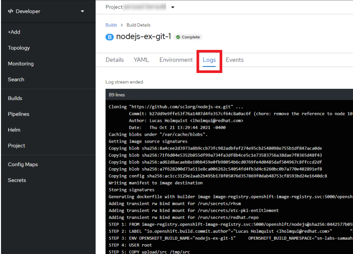
  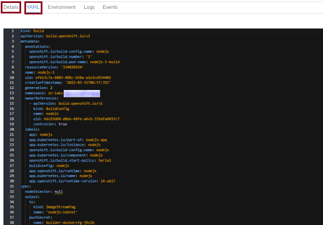

---

### 6. Application Access & Route

* Opened the application route from Topology view in a browser.
* Verified deployed Node.js app responded successfully.
  📷 *Screenshot: running Node.js app*
  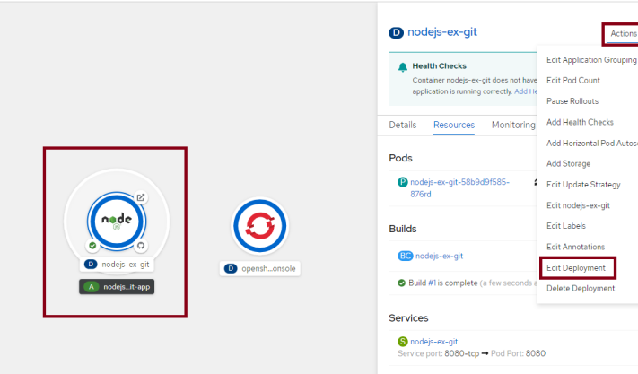

---

### 7. Autoscaling Setup (HPA)

* Edited Deployment YAML to add resource requests/limits:

```yaml
resources:
  limits:
    cpu: 30m
    memory: 100Mi
  requests:
    cpu: 3m
    memory: 40Mi
```

* Created an **HorizontalPodAutoscaler (HPA)** with target CPU utilization 10%, min=1, max=3 replicas.
  📷 *Screenshot: HPA creation*
  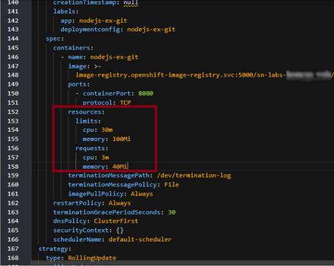
  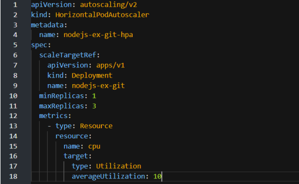

---

### 8. Autoscaling Verification

* Generated load on the application:

  ```bash
  for i in $(seq 1000); do curl -s -L <app_url> & done
  ```
* Observed scale up: Current Replicas → Desired Replicas = 3.
* Verified in UI with fruit entries simulating load.
  📷 *Screenshot: autoscaling in action*
  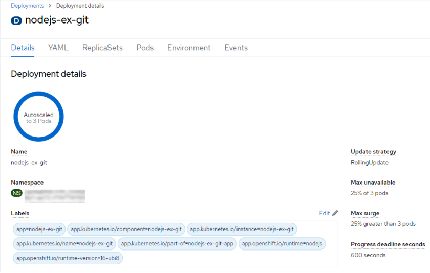

---

## 🎯 Achievements

* ✅ Verified OpenShift CLI and environment
* ✅ Explored OpenShift web console (Admin & Developer perspectives)
* ✅ Deployed Node.js app directly from GitHub using s2i build strategy
* ✅ Inspected BuildConfig, logs, and ImageStream
* ✅ Accessed app via auto-generated route
* ✅ Configured & tested Horizontal Pod Autoscaler

---

## 👨‍💻 Author

Developed and documented by **Ayoub CHAIEB**
---
